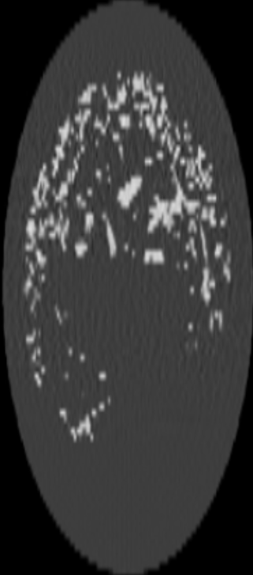
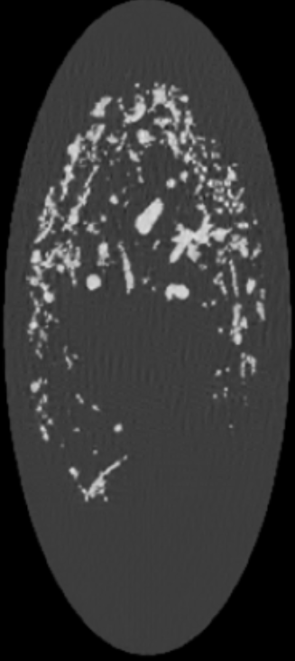
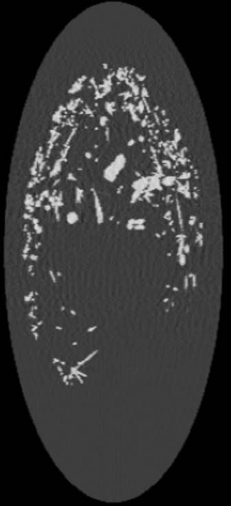

# Replication of SR4ZCT: Self-Supervised Through-Plane Resolution Enhancement for CT Images with U-Net on synthetic phantoms

A PyTorch implementation of self-supervised through-plane super-resolution for Computed Tomography volumes, built on the [SR4ZCT framework](https://link.springer.com/chapter/10.1007/978-3-031-44153-0_6) (Shi et al., 2023). Developed as the final project for the Computational Imaging and Tomography (CITO) course at Leiden University, under supervision of Prof. Dr. K.J. Batenburg (CWI Amsterdam / Leiden University).

## Overview

CT scanners produce volumes with lower resolution in the through-plane (z-axis) direction than in-plane. This project implements a fully self-supervised pipeline to enhance through-plane resolution — learning entirely from within-volume geometry across orthogonal planes, with no paired high/low-resolution training data required.

The pipeline covers:
- Procedural 3D lung phantom generation (512×512×512 voxels) using PyVista and VTK
- Full CT simulation via forward projection and SIRT reconstruction using the [ASTRA Toolbox](https://www.astra-toolbox.com/)
- Self-supervised training data generation via off-axis slice degradation
- 2D U-Net training in PyTorch for slice-wise super-resolution
- Quantitative evaluation using PSNR and SSIM across held-out orthogonal planes

## Key Results

Best-performing model (fibrous phantom, Y-axis orientation, no normalisation):

| Metric | Baseline (LR input) | Model output | Improvement |
|--------|--------------------|--------------------|-------------|
| PSNR   | 39.13 dB           | **41.57 dB**       | **+2.44 dB** |
| SSIM   | —                  | **0.99**           | Near-perfect structural fidelity |

Results across all 7 phantom configurations consistently showed PSNR improvements of +1.1 to +2.44 dB and SSIM values of 0.96–0.99. The model was trained exclusively on coronal-plane slices and evaluated on axial and sagittal planes, confirming genuine cross-plane generalisation rather than memorisation.

Full results table:

| Radius | Phantom type | Axis | PSNR diff (no norm) | Output PSNR | Output SSIM |
|--------|-------------|------|---------------------|-------------|-------------|
| 5      | Fibre        | Y    | **+2.44 dB**        | 41.57 dB    | 0.99        |
| 5      | Fibre        | X    | +1.76 dB            | 38.15 dB    | 0.98        |
| 5      | Fibre        | Z    | +1.36 dB            | 40.10 dB    | 0.98        |
| 5      | Standard     | —    | +1.61 dB            | 36.94 dB    | 0.97        |
| 5      | Standard     | —    | +1.42 dB            | 36.17 dB    | 0.97        |
| 5      | Standard     | —    | +1.55 dB            | 36.93 dB    | 0.97        |
| 2      | Standard     | —    | +1.14 dB            | 37.16 dB    | 0.97        |

*Metrics correspond to the epoch with highest PSNR improvement for each configuration.*

Visual comparison on a held-out test slice:

| Low-resolution input | Model output | Ground truth |
|---|---|---|
|  |  |  |

## Method

### Phantom generation

Custom procedural 3D lung phantoms are generated and stored in the `phantoms/` directory:
- Recursive bronchial tree with configurable branching randomness, anatomically constrained by lung surface meshes (marching cubes)
- Two structural modes: standard organic branching and fibre-growth (anisotropic, axis-aligned along X, Y, or Z)
- Pre-generated phantoms follow the naming convention `bro_512_{radius}_{fibre}_{axis_index}.npy/.vtk`
- Seven phantom configurations varying branch radius (2 or 5), fibre mode (True/False), and axis index (0/1/2)

### CT simulation (ASTRA Toolbox)

High-resolution phantoms are passed through a full CT acquisition pipeline:
1. **Forward projection** — parallel beam geometry, 180 angles over 360°
2. **Sinogram generation** — simulating raw detector measurements (see `sino.png`)
3. **SIRT reconstruction** — producing physically plausible low-resolution volumes for inference

### Self-supervised training data

Following the SR4ZCT approach, LR/HR pairs are generated from axial slices:
- Degradation: 1D downsampling by factor 4 along a single axis using `scipy.ndimage.zoom` (order=1, bilinear), followed by upsampling — simulating through-plane resolution loss
- Each slice degraded twice (vertical and horizontal); horizontal-degraded images rotated 90° for consistent canonical blur orientation
- Training set: coronal-plane slices only — test set: axial and sagittal (never seen during training)

### U-Net architecture (PyTorch)

A flexible 2D U-Net with:
- Configurable encoder-decoder depth using 3×3 convolutions and max-pooling
- Bilinear upsampling in decoder (avoids checkerboard artefacts)
- Skip connections concatenating encoder feature maps to decoder at each scale
- Final 1×1 convolution projecting to single-channel grayscale output
- Training: Adam optimiser (lr=1×10⁻³), MSE loss, 50 epochs with per-epoch checkpointing

### Key findings

- **Fibrous phantoms outperform standard** — structured, anisotropic patterns provide a clearer degradation signal, yielding up to +2.44 dB gain vs +1.61 dB for standard phantoms
- **Fibre axis matters** — Y-axis fibres are most learnable; Z-axis are hardest, likely due to interaction between fibre orientation and degradation axes
- **Normalisation has mixed effect** — training without normalisation achieved slightly better peak PSNR; normalisation gave more stable training loss
- **Peak performance occurs early** — best results at epochs 8–17; prolonged training leads to overfitting on the coronal training distribution. Early stopping is recommended.

## Repository structure

```
cito-minmax/
├── 0_generate_phantoms.py          # Step 1: procedural 3D lung phantom generation
├── 1_generate_sino_reconstruct.py  # Step 2: ASTRA CT simulation and SIRT reconstruction
├── 2_generate_dataset.py           # Step 3: self-supervised LR/HR pair generation
├── 3_train.py                      # Step 4: U-Net training with PSNR/SSIM evaluation
├── reconstruct.py                  # ASTRA reconstruction utilities
├── utils.py                        # Shared utilities (degradation, metrics, data loading)
├── parser.py                       # Shared argument parser for all pipeline steps
├── test_astra.py                   # ASTRA Toolbox installation test
├── astra_colab.ipynb               # Colab-compatible notebook for the full pipeline
├── install_astra                   # ASTRA installation script
├── environment.yml                 # Conda environment definition
├── requirements.txt                # pip dependencies
├── pyproject.toml                  # Project metadata
├── phantoms/                       # Pre-generated phantom .npy and .vtk files
│   └── bro_512_{radius}_{fibre}_{axis}.npy / .vtk
├── results/                        # Per-run PSNR/SSIM logs and result directories
│   ├── all_epochs.csv
│   ├── best_epochs.csv
│   ├── last_epochs.csv
│   └── result_{config}/
├── old/                            # Earlier phantom generation prototypes
│   ├── phantom.py
│   └── phantom3d.py
├── bronchi.png                     # Bronchial tree 3D visualisation
├── lung.png                        # Full lung phantom visualisation
├── sino.png                        # Example sinogram
├── LR.png                          # Example low-resolution input slice
├── HR.png                          # Example model output slice
├── GT.png                          # Example ground truth slice
├── train.jpeg                      # Training curve visualisation
└── CITO_final_project.pdf          # Full project report
```

## Setup

**Conda (recommended):**
```bash
conda env create -f environment.yml
conda activate <env_name>
```

**pip:**
```bash
pip install -r requirements.txt
```

ASTRA Toolbox requires separate installation — see `install_astra` or the [ASTRA documentation](https://www.astra-toolbox.com/). GPU with CUDA is strongly recommended. Test your installation with:
```bash
python test_astra.py
```

A fully self-contained Colab notebook is available at `astra_colab.ipynb` if you do not have a local GPU.

## Usage

The pipeline runs in four numbered steps:

```bash
# Step 1 — generate phantoms
python 0_generate_phantoms.py

# Step 2 — CT forward projection and SIRT reconstruction
python 1_generate_sino_reconstruct.py

# Step 3 — generate self-supervised training dataset
python 2_generate_dataset.py

# Step 4 — train the U-Net
python 3_train.py --phantom_type fibre --axis Y --normalize False --epochs 50
```

See `parser.py` for all available arguments. Results (PSNR and SSIM per epoch) are saved to the `results/` directory as CSV files.

## References

- Shi, J., Pelt, D.M., Batenburg, K.J. (2023). *SR4ZCT: Self-supervised Through-Plane Resolution Enhancement for CT Images with Arbitrary Resolution and Overlap*. Springer Nature Switzerland, pp. 52–61.
- van Aarle, W. et al. (2016). *Fast and Flexible X-ray Tomography Using the ASTRA Toolbox*. Optics Express 24(22), 25129–25147.

## Authors

- Jyothis Gireesan Mini (s3777103) — Leiden University, MSc Artificial Intelligence
- Michail Athanasios Kalligeris Skentzos (s4398831) — Leiden University, MSc Computer Science

Academic supervisor: Prof. Dr. K.J. Batenburg (CWI Amsterdam / Leiden University)

Leiden University — Computational Imaging and Tomography (CITO) course, 2025
